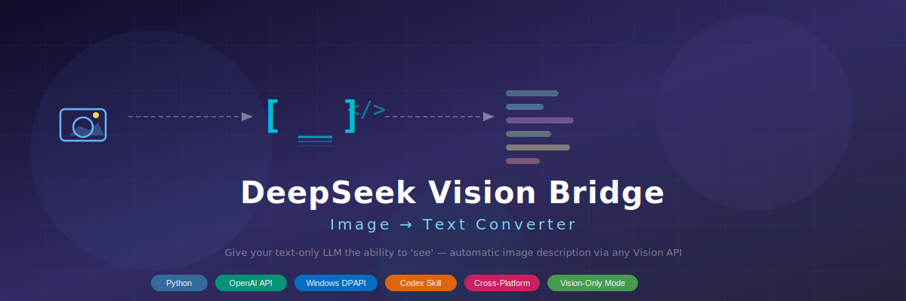
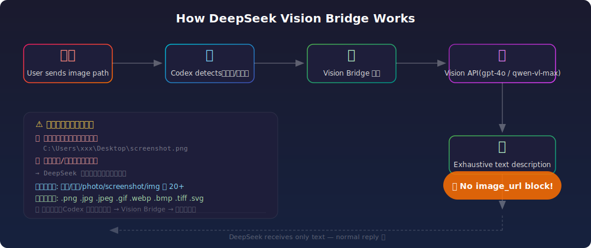

# 🖼️ DeepSeek Vision Bridge

> **Give your text-only LLM the ability to "see"** — Automatically intercept images, convert them to exhaustive text descriptions via any Vision API, and feed clean text to DeepSeek (or any text-only model).

<p align="center">
  
</p>

<p align="center">
  <a href="#-quick-start"></a>
  <a href="#-quick-start"></a>
  <a href="#-configuration"></a>
  <a href="#-installation"></a>
  <a href="LICENSE"></a>
</p>

---

## 📋 Table of Contents

- [The Problem](#-the-problem)
- [How It Works](#-how-it-works)
- [⚠️ Critical: How to Send Images](#️-critical-how-to-send-images)
- [🔍 Trigger Detection](#-trigger-detection)
- [✨ Features](#-features)
- [🚀 Quick Start](#-quick-start)
- [🔧 Configuration](#-configuration)
- [📖 Command Reference](#-command-reference)
- [🧠 Smart Q&A Mode](#-smart-qa-mode)
- [🎯 Supported Vision Models](#-supported-vision-models)
- [🛡️ Defense Mode (Auto-Intercept)](#️-defense-mode-auto-intercept)
- [📦 File Structure](#-file-structure)
- [🔒 Security & Privacy](#-security--privacy)
- [❓ Troubleshooting](#-troubleshooting)
- [📄 License](#-license)

---

## 🎯 The Problem

**DeepSeek (Flash / Pro) is a text-only model.** It cannot process images. If you send an image directly:

```
Failed to deserialize the JSON body: unknown variant `image_url`, expected `text`
```

**The entire conversation crashes irrecoverably.**

---

## 🌉 How It Works

<p align="center">
  
</p>

```
User (image path) → Codex detects keywords/extensions → Vision Bridge invoked
    → Vision API (gpt-4o / qwen-vl-max / etc.) → Exhaustive text description
    → DeepSeek receives only text → Normal reply ✅  (NO image_url block!)
```

---

## ⚠️ Critical: How to Send Images

> **🚨 THIS IS THE MOST IMPORTANT RULE — READ CAREFULLY**

DeepSeek is **text-only**. Sending the image directly will **crash the conversation permanently**.

### ✅ CORRECT: Use File Path

Always paste the **absolute file path** of your image into the chat:

```powershell
C:\Users\YourName\Desktop\screenshot.png
C:\Users\YourName\Pictures\photo.jpg
D:\images\chart.webp
```

The system automatically detects the file path, analyzes the image via Vision API, and converts it to text before DeepSeek ever sees it.

### ❌ INCORRECT: Never Do This

| ❌ Action | Result |
|-----------|--------|
| Drag & drop image into chat | ❌ Conversation crashes |
| Paste image from clipboard | ❌ Conversation crashes |
| Send image via `image_url` block | ❌ Conversation crashes |
| Send image via URL without file path | ❌ Model crashes |

**There is no recovery.** Once the conversation crashes, you must start a new one.

---

## 🔍 Trigger Detection

The system automatically scans every user message. It triggers Vision Bridge when **any** of the following patterns are detected.

### File Extensions (Automatic Match)

```
.png  .jpg  .jpeg  .gif  .bmp  .webp  .tiff  .svg  .ico
```

### Chinese Keywords

| Keyword | Pinyin | Translation |
|---------|--------|-------------|
| 图片 | tú piàn | image |
| 图 | tú | picture |
| 图中 | tú zhōng | in the image |
| 这张图 | zhè zhāng tú | this image |
| 那个图 | nà gè tú | that image |
| 截图 | jié tú | screenshot |
| 截屏 | jié píng | screenshot |
| 照片 | zhào piàn | photo |
| 相片 | xiàng piàn | photo |
| 图像 | tú xiàng | image |
| 看图 | kàn tú | look at image |
| 贴图 | tiē tú | post image |
| 发图 | fā tú | send image |
| 上图 | shàng tú | upload image |
| 下图 | xià tú | image below |
| 如图 | rú tú | as shown |
| 见图 | jiàn tú | see image |
| 图示 | tú shì | diagram |
| 配图 | pèi tú | accompanying image |
| 原图 | yuán tú | original image |
| 大图 | dà tú | large image |
| 小图 | xiǎo tú | small image |
| 缩略图 | suō lüè tú | thumbnail |
| 动图 | dòng tú | animated image |
| 表情包 | biǎo qíng bāo | meme/sticker |
| 壁纸 | bì zhǐ | wallpaper |
| 头像 | tóu xiàng | avatar |
| 扫码 | sǎo mǎ | scan QR code |
| 二维码 | èr wéi mǎ | QR code |

### English Keywords

```
image  photo  picture  screenshot  snapshot  pic  img
```

### Trigger Logic

> **Keyword + file path or URL** → Vision Bridge triggers immediately.
> File path alone (e.g., `C:\...\img.png`) with image extension also triggers.

---

## ✨ Features

| Feature | Description |
|---------|-------------|
| **🛡️ Auto-Defense Mode** | Codex automatically intercepts images before they reach DeepSeek |
| **🧠 Smart Q&A** | User asks a question + sends image → Vision Bridge answers both |
| **🔧 Manual Tool Mode** | Call `invoke-describe.ps1` directly for CLI usage |
| **🌐 Multi-Source** | Supports file paths, HTTP URLs, and data: URLs |
| **🖼️ Multi-Image** | Process multiple images sequentially with labels |
| **🔍 Screenshot Locator** | Auto-find recent screenshots on your system |
| **✅ Image Validation** | Verify image readability before analysis |
| **🔬 Diagnostic Mode** | Check environment health without API calls |
| **🔄 PNG Conversion** | Convert any image format to PNG |
| **🔒 DPAPI Encryption** | API key stored encrypted via Windows DPAPI |
| **🧪 Retry Logic** | Automatic retry with exponential backoff on failures |

---

## 🚀 Quick Start

### 1. Installation

```bash
# Clone the repository
git clone https://github.com/YOUR_USERNAME/deepseek-vision-proxy.git
cd deepseek-vision-proxy

# Install Python dependencies
pip install httpx Pillow
```

### 2. Copy to Codex Skills Directory

```powershell
# Copy the entire folder to Codex skills
Copy-Item -Recurse -Path ".\deepseek-vision-proxy" -Destination "$env:USERPROFILE\.codex\skills\deepseek-vision-proxy"
```

### 3. Configure

Run the configuration script:

```powershell
powershell -NoProfile -ExecutionPolicy Bypass `
  -File "$env:USERPROFILE\.codex\skills\deepseek-vision-proxy\scripts\configure.ps1" -Language zh
```

You will be prompted for 3 things:

| Setting | Description | Example |
|---------|-------------|---------|
| **Vision API Key** | Any vision-capable API key | `sk-...` (input hidden) |
| **Vision API URL** | API base URL (OpenAI compatible) | `https://api.openai.com` |
| **Vision Model** | Vision model name | `gpt-4o`, `qwen-vl-max`, `claude-sonnet-4.6` |

> **Note:** The API key is stored encrypted via **Windows DPAPI** — never stored in plain text.
> The URL and model are saved as user-level environment variables.

### 4. Done!

Once configured, Codex will automatically use Vision Bridge whenever it detects an image. No manual steps needed.

---

## 🔧 Configuration

### Environment Variables

| Variable | Description | Set By |
|----------|-------------|--------|
| `DEEPSEEK_VISION_BRIDGE_API_KEY` | Vision API key (DPAPI encrypted) | `configure.ps1` |
| `DEEPSEEK_VISION_BRIDGE_BASE_URL` | Vision API base URL | `configure.ps1` |
| `DEEPSEEK_VISION_BRIDGE_MODEL` | Vision model name | `configure.ps1` (default: `gpt-4o`) |
| `DEEPSEEK_VISION_BRIDGE_SYSTEM_PROMPT` | Custom system prompt (optional) | Manual |

### Custom Models

You can override the model at runtime:

```powershell
$env:DEEPSEEK_VISION_BRIDGE_MODEL = "gpt-4o"
& ".\scripts\invoke-describe.ps1" -Image "photo.png"
```

---

## 📖 Command Reference

### `invoke-describe.ps1`

| Parameter | Type | Description |
|-----------|------|-------------|
| `-Image <path/url>` | string | Image source (file path, URL, or data: URL) |
| `-Question <text>` | string | User question about the image (for Smart Q&A) |
| `-Detail <auto/low/high>` | string | Vision detail level (default: auto) |
| `-Model <name>` | string | Override vision model for this call |
| `-Quiet` | switch | Suppress progress messages |
| `-Locate` | switch | Search for recent image files |
| `-Check <path>` | string | Validate image readability |
| `-Test` | switch | Diagnose environment without API call |
| `-Convert <path>` | string | Convert image to PNG format |

#### Examples

```powershell
# Basic image analysis
.\scripts\invoke-describe.ps1 -Image "C:\Users\me\screenshot.png"

# Smart Q&A: question + image
.\scripts\invoke-describe.ps1 -Image "photo.jpg" -Question "这个人是谁？"

# Find recent screenshots
.\scripts\invoke-describe.ps1 -Locate

# Validate image
.\scripts\invoke-describe.ps1 -Check "image.png"

# Environment diagnostics
.\scripts\invoke-describe.ps1 -Test

# Convert to PNG
.\scripts\invoke-describe.ps1 -Convert "image.webp"
```

### `configure.ps1`

| Parameter | Description |
|-----------|-------------|
| `-Language <zh/en>` | Interface language (default: auto-detect) |

---

## 🧠 Smart Q&A Mode

When the user sends **both an image path and a question**, the system intelligently extracts both and passes them to Vision Bridge.

### How it works

```
User: "这个人是谁？C:\Users\me\photo.png"
        ↓
Agent extracts: Image = "C:\Users\me\photo.png", Question = "这个人是谁？"
        ↓
Vision Bridge returns:
  [PRELIMINARY ANALYSIS] → Direct answer to the question
  [IMAGE DESCRIPTION]   → Exhaustive full description
        ↓
Agent uses these as context for DeepSeek → Deep answer ✅
```

### Example output

```markdown
我已通过 Vision Bridge 分析了你的图片：
---
[PRELIMINARY ANALYSIS]
The person in the photo appears to be...

[IMAGE DESCRIPTION]
This is a photograph showing...
---
基于以上内容，我的回复是：
<detailed text response>
```

---

## 🎯 Supported Vision Models

This tool is **model-agnostic** — it works with any OpenAI-compatible vision API. Just configure your Key, URL, and model name.

| Provider | URL Example | Model Example |
|----------|-------------|---------------|
| **OpenAI** | `https://api.openai.com` | `gpt-4o`, `gpt-4o-mini` |
| **Alibaba DashScope** | `https://dashscope.aliyuncs.com/compatible-mode/v1` | `qwen-vl-max`, `qwen-vl-plus` |
| **Anthropic** (via proxy) | `https://your-proxy.com` | `claude-sonnet-4.6` |
| **Google Gemini** (via proxy) | `https://your-proxy.com` | `gemini-2.5-flash`, `gemini-2.5-pro` |
| **Any OpenAI-compatible proxy** | Your proxy URL | Any vision model supported |

---

## 🛡️ Defense Mode (Auto-Intercept)

When configured as a **Codex Skill**, the system runs in **Defense Mode**:

### Step 1: Detection
User message → Scan for keywords + path patterns

### Step 2: Intercept
**Don't wait. Don't hesitate.** Immediately call Vision Bridge.

### Step 3: Pure Text Reply
**NEVER include `image_url` blocks or any image references in the reply.**

```markdown
我已通过 Vision Bridge 分析了你的图片：
---
[complete text description]
---
基于以上内容，我的回复是：
<text-only response>
```

---

## 📦 File Structure

```
deepseek-vision-proxy/
├── README.md                   # This file
├── SKILL.md                    # Codex Agent instruction file
├── LICENSE                     # MIT License
├── .gitignore                  # Ignores *.dpapi.txt (API keys never uploaded)
├── docs/
│   ├── banner.svg              # Project banner (SVG)
│   └── flow.svg                # Workflow diagram (SVG)
└── scripts/
    ├── describe_image.py       # 🔥 Core: image → text description engine
    ├── invoke-describe.ps1     # PowerShell wrapper: DPAPI decrypt → call Python
    └── configure.ps1           # Interactive configuration script
```

---

## 🔒 Security & Privacy

| Concern | Protection |
|---------|-----------|
| **API Key storage** | Encrypted via **Windows DPAPI**, tied to your Windows user account |
| **Key in transit** | Never appears in plain text in config files, logs, or command line |
| **Source code** | `.gitignore` excludes `*.dpapi.txt` — keys never uploaded to GitHub |
| **Image data** | Processed only in memory, never written to disk unnecessarily |
| **Network** | Images sent only to **your configured** Vision API endpoint |
| **No telemetry** | Zero data collection, zero analytics, zero phone-home |

### Privacy Warning

> Images you upload are sent to the Vision API endpoint you configured. If using a third-party proxy, your image data will be processed by that service. Review the privacy policy of your chosen provider before sending sensitive images.

---

## ❓ Troubleshooting

| Symptom | Cause | Solution |
|---------|-------|----------|
| `[ERROR] API key not set` | Key not configured | Run `configure.ps1` |
| `[ERROR] Authentication failed (401)` | Invalid/expired key | Re-run `configure.ps1` |
| `[ERROR] HTTP 400` | Model doesn't support vision | Switch to `gpt-4o` or `qwen-vl-max` |
| `[ERROR] Vision API unreachable` | Network/URL issue | Check URL and network connectivity |
| `[ERROR] Request timeout` | Image too large / API slow | Wait up to 120s, or resize image |
| `Python not found` | Python not installed | `winget install Python.Python.3.12` |
| `No module named 'PIL'` | Pillow not installed | `pip install Pillow httpx` |
| `[ERROR] Empty description` | API returned empty | Retry or switch model |
| Chinese text garbled | Console encoding | Scripts force UTF-8 output |
| Conversation crashed | `image_url` block sent | **Never drag-and-drop images!** Start new conversation |

---

## 📄 License

[MIT](LICENSE) — Free to use, modify, and distribute.

---

<p align="center">
  Made for the <a href="https://github.com/openai/codex">OpenAI Codex</a> ecosystem.
  <br>
  <sub>Give DeepSeek eyes, one description at a time. 🖼️→📝</sub>
</p>
